# ProjetoElite

Link do Site: http://54.237.202.170:3000/
APK do aplicativo: https://expo.dev/artifacts/74ae5bf5-4449-4679-bdc9-8ad014a92fcb

## 1. Explicação 
Elite é um projeto que visa fazer uma ponte entre prestadores de serviço e seus clientes, através de um catalógo de microprestadores de serviço disponível
no aplicativo, e no qual, é possível cadastrar sua microempresa através do nosso site. 

## 2. Configurações

*É necessário ter o Node JS, NPM, Expo (a biblioteca em seu PC e o aplicativo em seu smartphone) e o banco de dados MySQL instalado em sua máquina.

instalando o nodemon:

npm install nodemon -g

### 2.1. Rede

EliteApp/config/network.js
EliteSite/src/config/network.js

ajuste de acordo com o seu IP local

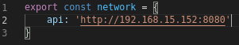

### 2.2. Mysql Statement:

é necessário executar este comando para que tudo ocorra certo.

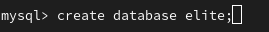

### 2.3. API

no diretório ".api/" siga estes passos:

execute "npm install"

.env configuração
ajuste as variáveis de acordo com o usuário e senha do seu banco de dados MySQL
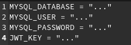

Em *todos os models presentes na API há alguma destas seguintes linhas comentadas:

//db.sequelize.sync({force: true}) 
ou
//<Nome da Model>.sync({force: true});

Para que tudo ocorra certo no banco de dados é necessário que você apague esta linha de cada um e utilize o comando "node <Nome do arquivo>", logo após isso comente a linha novamente.

A ordem pra executar os arquivos é:

node Microempresas
node Avaliacao
node Cliente
node createComentarios (este é o único arquivo que não possue essa linha comentada então apenas execute ele)

Agora basta executar o comando "nodemon api.js" para rodar a api na porta 8080

### 2.4. APP

na pasta ".EliteApp/" execute: "npm install" e depois "npm start" para rodar o app 

### 2.5. SITE

na pasta ".EliteSite/" execute: "npm install" e depois "npm start" para rodar o site na porta 3000

## 3. Demonstrações

### 3.1. APP
  
  #### 3.1.1 Tela de Início
  
  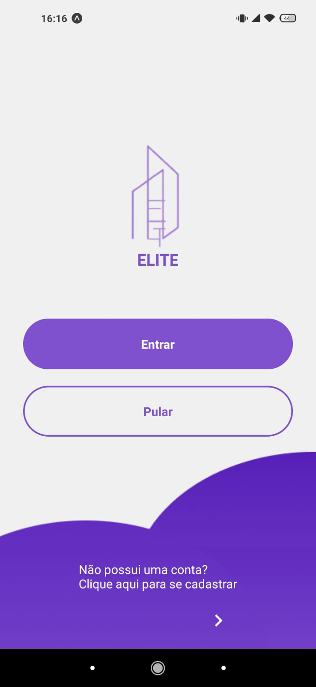
  
  #### 3.1.2 Cadastro
  
  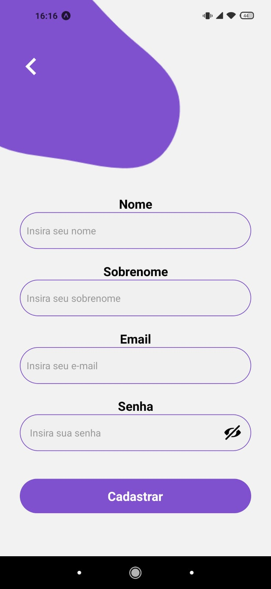
  
  #### 3.1.3 Categorias
   
  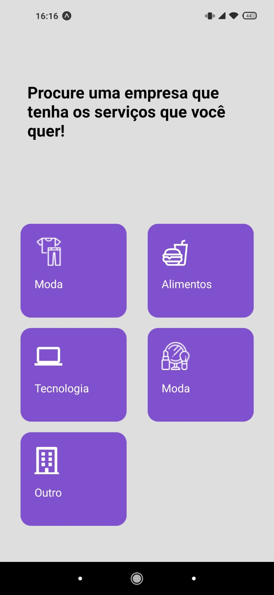
  
  #### 3.1.4 Home
  
  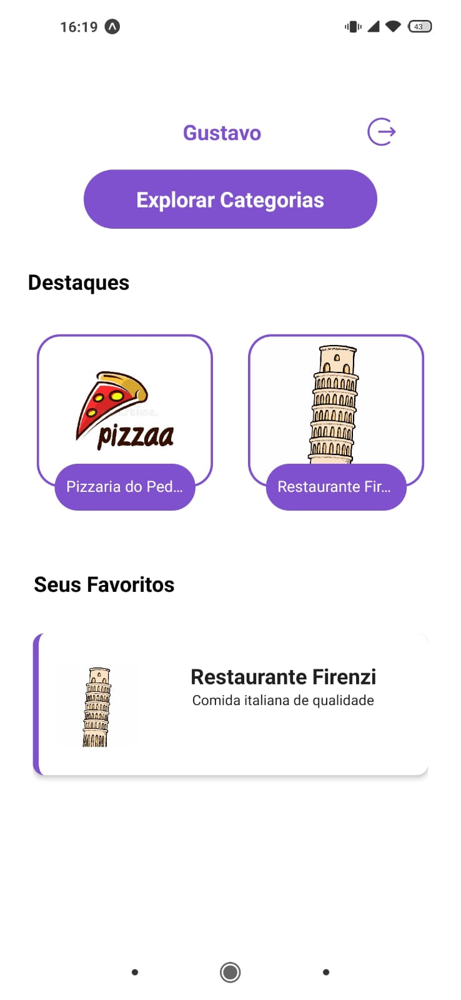
  
  #### 3.1.5 Busca
  
  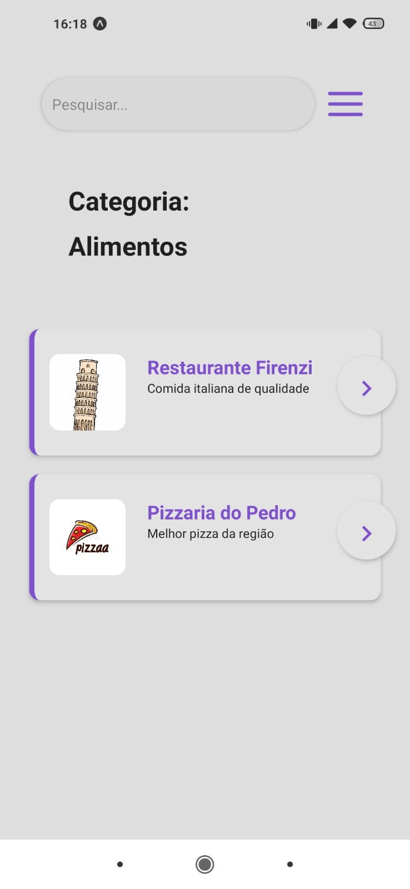
  
  #### 3.1.6 Detalhes da Empresa
  
  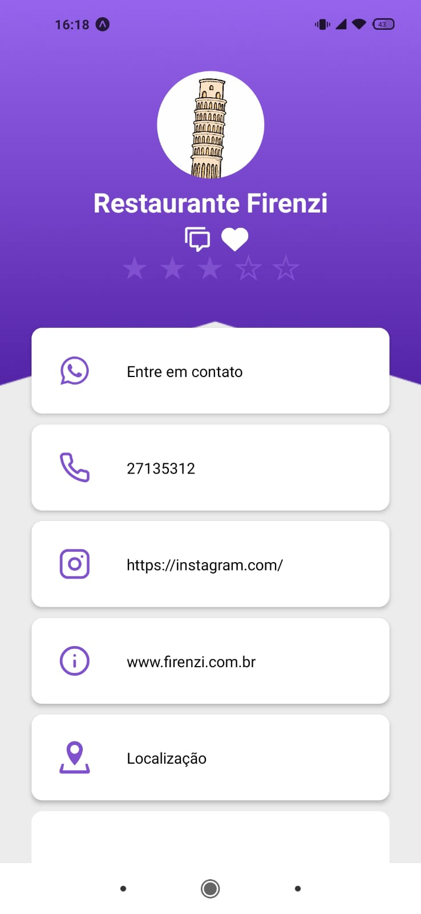
  
  #### 3.1.8 Comentários
  
  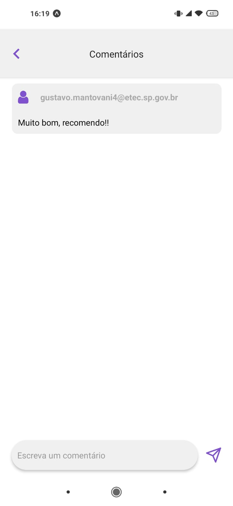
  
### 3.2 SITE
  
  #### 3.2.1 Tela Inicial
  
  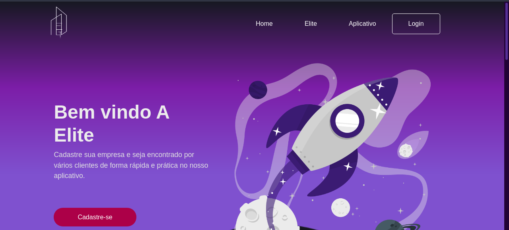
  
  #### 3.2.2 Cadastro
  
  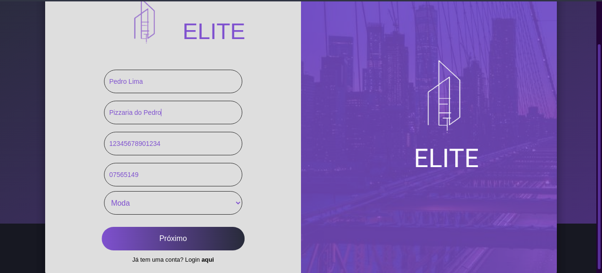
  
  #### 3.2.3 Info da Empresa
  
  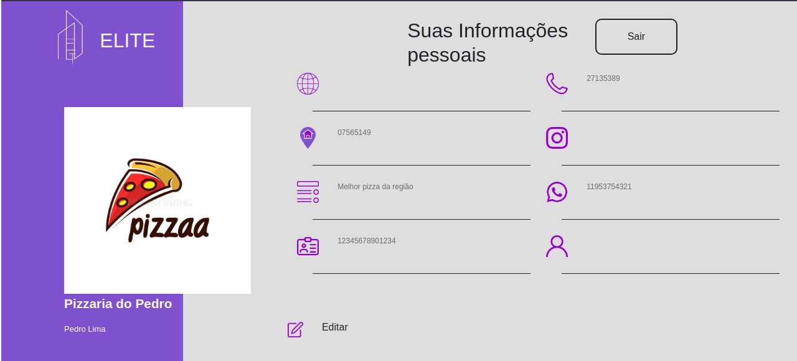
