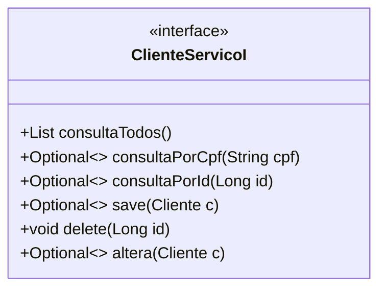
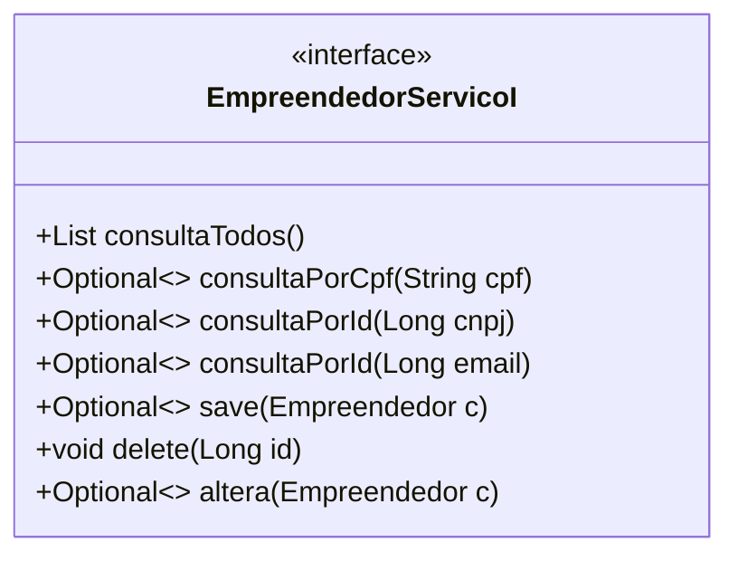
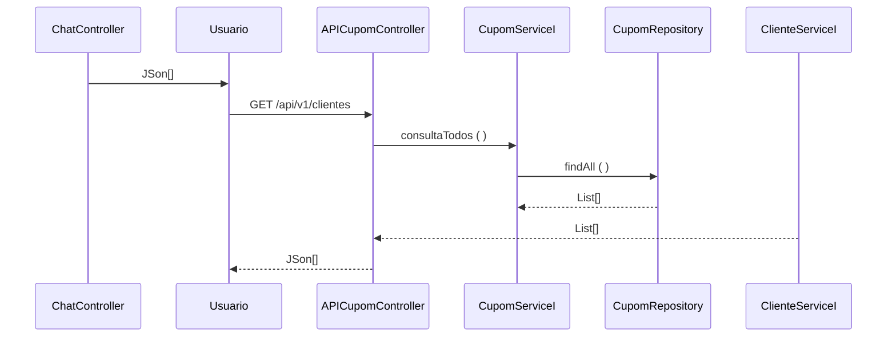

### Fatec ZL - Centro Paula Souza
#### Disciplina - Programação Web III
Grupo 3
- <a href = "https://github.com/Beatriz-Chagas">Beatriz Chagas de Sousa</a>
- <a href = "https://github.com/eloocunha">Eloisa da Cunha</a>
- <a href = "https://github.com/PriscilaDias2003">Priscila Gabriele Dias Ribeiro</a>
#### Processo de Desenvolvimento de Software - PDS
> O PDS segue uma abordagem interativa incremental adaptada do Scrum. Cada interação tem uma definição de pronto estabelecida com objetivo de controlar a qualidade do web site. 
> Utilizando de alguns dos principios do SOLID, como o da segregação "Uma classe não deve ser forçada a implementar interfaces e métodos que não utilizará".
#### Estudo de Caso – Sistema Integrado de Gestão
> Trazer para os  microempresários  e  clientes  em  uma ferramenta para coloca-los em contato  através  da  tecnologia, tornando o esforço de marketing.   queremos   melhorar   a   forma   de relacionamento empresário/cliente,  facilitando  o  caminho  entre  os  dois,  tornando  mais  simples  e rápido o encontro dos dois.

#### Sprint Backlog
> Cada requisito tem um identificador único de maneira que seja possível rastrear a necessidade do cliente com a implementação do software.

||||SPRINT 1||||
|-------------|------------|-------------|-------------|----------|-----------|------|
| ID | Nome | Usuário | Descrição | Prioridade | Horas |Status |
| REQ01 | Cadastrar |Microempreendedor | Empreendedor precisa conseguir cadastrar suas informações basica que são requeridas pelo próprio formulario. | Alta | 2| Feito |
| REQ02 | Cadastrar| Cliente | Cliente precisa conseguir cadastrar suas informações básicas que já são requeridas no formulário do próprio site. | Alta | 2| Feito |
| REQ03 | Login |Microempreendedor|É necessário ser possível fazer o login na conta cadastrada do microempreendedor utilizando email e senha.| Alta |2| Feito |
| REQ04 | Login |Cliente|É necessário ser possível fazer o login do cliente na conta cadastrada utilizando apenas o email e senha deste.| Alta | 2| Feito |
| REQ05 | Logout| Microempreendedor |O usuário deve conseguir realizar o logout do site com segurança sem o dano em nenhum dado. | Media | 1| Feito |
| REQ06 | Logout |Cliente |O usuário deve conseguir sair do site e fazer o logout com segurança e sem problemas com seus dados. | Media | 1| Feito |

||||SPRINT 2||||
|-------------|------------|-------------|-------------|-----------|----------|------|
| ID | Nome | Usuário | Descrição | Prioridade | Horas |Status |
| REQ07 | Rota Cliente | Cliente|Criação de paginas de acesso do cliente e o design destas, onde poderá ver o proprio perfil, e suas informações fornecidas.| Media | 3| Feito |
| REQ08 | Poder alterar | Cliente |Desenvolvimento de um meio de alterar as informações cadastrais fornecidas pelo cliente no back end. | Alta | 5| Feito |
| REQ09 | Alterar Dados | Cliente|Deve ser possível para o cliente alterar as informações que ele mesmo cadastrou.| Media| 3| Feito |
| REQ10 | Alterar Dados | Microempreendedor|As informações cadastradas precisam ter a opção de serem alteradas pelo próprio microempreendedor exceto por informações chave que não variam. | Alta | 5| Feito |
| REQ11 | Validação de dados | Sistema|Quando o cliente estiver se cadastrando, os campos CPF, email, telefone e cep serão validados, mostrando quando algum destes tem um erro após clicar em “próximo”. | Alta | 4| Feito |
| REQ12 | Validação de dados | Sistema|Quando o Microempreendedor estiver se cadastrando os campos CNPJ, email, telefone e cep serão validados e mostrarão caso algum dos campos obrigatórios esteja vazio ou com informação inválida. | Alta | 4| Feito |
| REQ13 | Alterar do front-end |Sistema|Realizamos algumas alterações de design no site e acrescentamos algumas outras como na rota do cliente. | Baixa | 2| Feito |
| REQ14 | Responsividade| Sistema|Implementamos a Responsividade nas páginas do site, tornando possível que o site mantenha sua estrutura e layout mesmo em telas de diversos tamanhos sejam estes menores ou maiores. | Baixa | 5| Feito |

||||SPRINT 3||||
|-------------|------------|-------------|-------------|----------|-----------|------|
| ID | Nome | Usuário | Descrição | Prioridade | Horas |Status |
| REQ015 | Listagem de empresas | Sistema |O sistema deve conseguir fazer as listagens de empresa para que os clientes consigam visualizar as demais opções de empresas disponíveis para realizar eterminados serviços. | Média |3| Feito |
| REQ16 | Destaques de empresa | Cliente| Os dados de listagem de empresa que foram acrescentados ao site aparecem para o cliente por intermédio dos destaques de empresa por categorias de nichos mercadológico. | Media |2| Feito |
| REQ17 | Ver informações| Cliente|Após realizar procura pela empresa desejada através do esquema de categorias como modo de filtragem, o cliente ao clicar em “ver” poderá ter acesso a mais informações sobre a empresa fornecidas pela mesma, assim como outras opções de interação.| Baixa |3| Feito |
| REQ18 | Favoritar empresas| Cliente |Após receber as opções de empresas que estão disponibilizando seus serviços, caso queira guarda o acesso mais rápido á aquela empresa, é possibilitado que o cliente favorite aquele empresa através do botão em formato de coração abaixo do nome da mesma. | Baixa | 1| Feito |
| REQ19 | Desfavoritar empresa | Cliente |Quando o cliente já favoritou determinada empresa por quaisquer que sejam o motivo e queira desfazer esta ação, é possível que seja realizada através do clique no mesmo botão de coração, agora em uma coloração diferente, demostrando que a operação foi ou não realizada. | Media | 2| Feito |
| REQ20 | Avaliar| Cliente |O cliente deve conseguir avaliar a empresa que foi selecionada ao clicar em uma das cinco estrelas que já indicam teor avaliativo, mostrado abaixo das informações básicas da empresa. | Baixa| 1| Feito |
| REQ21 | Avaliação | Microempreendedor |O microempreendedor deve conseguir ver as avaliações feitas pelos clientes em geral sobre sua empresa através da quantia de estrelas azuis conquistadas.|Baixa 1| Feito |
| REQ22 | Comentar | Cliente | Deve ser possível ao cliente fazer comentários na página da empresa, clicando em comentar para que possa demonstrar sua satisfação ou não de modo mais especifico, sendo também um modo de avaliar a empresa, ajudando a informar outros clientes.| 3| Feito |
| REQ23 | Comentário | Microempreededor |É necessário que seja possível ver os comentários feitos por clientes na pagina correspondente ao perfil da empresa. | Baixa | 3| Feito |
| REQ24 | Responder Comentário | Microempreededor |Após ter acesso aos comentários relativos a sua empresa é possível que o responsável da conta da empresa possa comentar de volta, respondendo possíveis duvidas ou reclamações dos clientes na pagina da empresa.| Baixa | 3| Feito |

||||SPRINT 4||||
|-------------|--|----------|-------------|-------------|---------------------|------|
| ID | Nome | Usuário | Descrição | Prioridade | Horas |Status |Status |
| REQ25 | Receber Mensagens | Cliente |Dentro do site o cliente deve ser capaz de receber as mensagem enviada para ele, que aparecerão no chat de conversas | Baixa |3| Feito |
| REQ26 | Ver Mensagens| Cliente|Assim que quaisquer mensagens tenham chegado ao cliente, é necessário que estejam visível para este ler no chat de conversas | Baixa |1| Feito |
| REQ27 | Mandar Mensagens | Cliente| Após a visualização da mensagem enviada pelo microempreendedor, será possível que uma resposta possa ser digitada e enviada pelo cliente no chat para conversas. | Baixa | 1| Feito |
| REQ28 | Receber Mensagens | Microempreendedor|Deve ser possível que após o cliente enviar mensagens para entrar em contato com a empresa, esta mensagem chegue ao microempreendedor pelo chat de conversas. | Baixa| 3| Feito |
| REQ29 | Ver Mensagens| Microempreendedor|Assim que quaisquer mensagens tenham chegado ao microempreendedor, é necessário que estas estejam visíveis para o destinatário no chat de conversas. | Baixa| 2| Feito |
| REQ30 | Mandar Mensagens| Microempreendedor|Após a visualização das mensagens recebidas, é importante que o microempreendedor seja capaz de responder de volta, enviando de volta mensagens para o cliente. | Baixa| 3| Feito |

||||SPRINT 5||||
|-------------|------------|-------------|-------------|-------------|--------|------|
| ID | Nome | Usuário | Descrição | Prioridade | Horas | Status |
| REQ31 | Rota ADM | Sistema|A criação da rota de administração será necessária principalmente ter acesso aos dados organizacionais e gerais de usuários. | Alta | 3| Feito |
| REQ32 | Exclusão de usuários | Sistema|O administrador, estando logado vai para sua respectiva página onde além   visualizar informações dos usuários, este terá também a possibilidade de gerir o cadastro dos usuários, deletando-os. | Média | 2| Feito |
| REQ33 | Contagem de usuários | Sistema|Dentro da rota do administrador estará disponível a visualização automática da quantia de usuários do site, sejam eles clientes ou microempreendedores. | Média| 1| Feito |
| REQ34 | Gráficos de usuários | Sistema|Utilizando das informações adquiridas com a contagem de usuários, informando a taxa de empresários e de clientes um referente ao outro visualmente com o gráfico. | Média| 1| Feito |
| REQ35 | Graficos de empresas | Sistema|Aderindo informações apenas da contagem de microempreendedores é gerando um gráfico expressando a quantia de empresas voltada para cada categoria mercadológica disponível no cadastramento destas em gráfico de pizza. | Média| 1| Feito |
| REQ36 | Layout ADM | Sistema|Acrescentar para a rota do administrador desenvolvida no back end, um front end em react padronizado de acordo com as demais páginas do site.| Alta | 2| Feito |
| REQ37 | Ayualização Front-end | Sistema|A realização de algumas mudanças na aparência do site para uma melhor padronização e o acréscimo de detalhes referentes ao novos itens.| Alta | 3| Feito |
| REQ38 | Pesquisa em tempo real| Cliente|Ao começar a escrever o nome da empresa buscada na barra de pesquisa, o cliente terá acesso a uma filtragem de opções onde aparecerão apenas empresas com nomes condizentes com a sentença escrita pelo cliente.| Média| 1| Feito |

||||SPRINT 6||||
|-------------|------------|-------------|-------------|---------|------------|------|
| ID | Nome | Usuário | Descrição | Prioridade | Horas |Status |
| REQ39 | Acrescentar Cupons | Microempreendedor |Desenvolvimento da implementação back-end da função cupom que oferecerá opções de taxas de descontos para que o microempreendedor possa escolher para disponibilizar para os clientes usufruírem em suas compras. | Baixa |3|Em andamento |
| REQ40 | Disponibilizar Cupons| Microempreendedor |O microempreendedor pode disponibilizar cupons no sistema para o cliente através de um botão responsável por gerar QR Codes aleatórios e sendo em seguida disponibilizado para o acesso e recebimento dos clientes.   | Baixa |2| Em andamento|
| REQ41 | Pegar Cupons| Cliente| O cliente poderá adquirir cupons de descontos em determinadas empresas que disponibilizaram-no previamente para usar em compras ou serviços destas mesmas empresas, após ir a pagina referente as informações disponíveis da determinada empresa será encontrado o código que deverá ser copiado e utilizado durante   | Baixa | 1| Em andamento |
| REQ42 | Remover Cupons | Microempreendedor|O microempreendedor poderá indisponibilizar os cupons anteriormente autorizados  no sistema para os clientes, através de um botão semelhante  ao de gerar cupons e sendo em seguida indisponibilizado para o acesso ou recebimento dos clientes.   | Baixa| 3| Em andamento |

### Definição de pronto
> O sprint será considerado concluido quando:
> 1) Os casos de teste de aceitação forem executados e obtiverem 100% de satisfatorios. Os casos de teste (CT) são rastreáveis para os requisiitos (REQ). O elo de rastreabilidade
é estabelecido pelo identificador do caso de teste.
> 2) Depois de executado os casos de teste com 100% de satisfatorios o código deve ser armazenado no github (commit).

### Casos de teste
| Identificador | Cenário de uso |
| ------------ | ------------------------------------------------------------------------ |
| REQ01CT01 | Dado (setup) que o CPF do cliente não está cadastrado; Quando (ação) o usuário confirma o cadastro; Então (resultado esperado) o sistema envia uma mensagem de cadastro realizado com sucesso |
| REQ01CT02 | Dado (setup) que o CPF do cliente está cadastrado; Quando (ação) o usuário confirma o cadastro; Então (resultado esperado) o sistema rejeita e envia uma mensagem de dados inválidos |
| REQ01CT03 | Dado (setup) que o CPF do microempreendedor não está cadastrado; Quando (ação) o usuário confirma o cadastro; Então (resultado esperado) o sistema envia uma mensagem de cadastro realizado com sucesso |
| REQ01CT04 | Dado (setup) que o CPF do microempreendedor está cadastrado; Quando (ação) o usuário confirma o cadastro; Então (resultado esperado) o sistema rejeita e envia uma mensagem de dados inválidos |
>
O modelo de dominio (Larman, 2006 - classes conceituais ou classes de negócio) foi definido considerando as seguintes classes:
![modelo de dominio]

>As entidades Cliente e Empreendedor foram identificadas como um serviço (ERL, 2007 - serviço do tipo entidade) o contrado das operações de sistema (LARMAN, 2006, pag.140) foram definidas no diagrama abaixo.

>O diagrama de sequência descreve como os varios componentes arquiteturais colaboram para manipular uma operação de sistema (exemplo para operação consultaTodos())

#### Dicionário
##### Microempresa
Id: <“int32”> = recebe o código único do microempreendedor.
nome_dono: <”string”> = Armazena o nome do microempreendedor.
nome_empresa:<”string”> = Armazena o nome da empresa.
cnpj: <”string”> = É responsável por validar a empresa por meio de um código único de empresas.
cep: <”string”> = É o código oficial do bairro onde reside a empresa.
categoria: <”string”> = É a categoria na qual a empresa se caracteriza.
telefone: <”string”> = Sequência numérica necessária para a comunicação e futura confirmação de identidade do acesso as informações do aplicativo.
whatsapp: <”string”> = Assim como o telefone, serve para o contato do cliente com a Microempresa por meio da plataforma whatsapp.
email: <”string”> = Email que servirá para auxiliar no cadastro e login do usuário no site e para que possa haver uma comunicação do cliente com a empresa.
site: <”string”> = Link para acessar o próprio site da empresa, caso haja um.
instagram: <”string”> = Link para a rede social Instagram.
facebook: <”string”> = Link para a rede social Facebook.
descricao: <”string”> = É uma pequena descrição do que a empresa faz e sobre seus serviços.
senha: <”string”> = Código de caracteres e números escolhidos pelo Microempreendedor, necessários para manter a sua segurança dentro da plataforma.
foto_perfil: <”string”> = Foto escolhida pelo próprio Microempreendedor para caracterizar sua empresa dentro do site. 

##### Cliente
id: <int32> = recebe o código único do cliente.

nome: <”string”> = Nome do usuário cliente.

ultimo_nome: <”string”> = Último nome do usuário cliente.

email:<”string”> = Email que servirá para auxiliar no cadastro e login do usuário no site e para que possa haver uma comunicação do cliente com a empresa.

senha:<”string”> = Código de caracteres e números escolhidos pelo Cliente, necessários para manter a sua segurança dentro da plataforma.

##### Avaliação
Nota: <”int32”> = Armazena a nota dada pelo cliente para uma empresa de acordo com experiências de uso.

##### Comentários
clienteID: <“int32”> = Recebe o código único do cliente.

MicroempresaID: <“int32”> = Recebe o código único do microempreendedor

#### Referencias
- [1] KRUCHTEN, Philippe. Reference: Title: Architectural blueprints—the “4+ 1” view model of software architecture. IEEE software, v. 12, n. 6, 1995.
- [2] RICHARDSON, Chris. Microservices patterns: with examples in Java. Simon and Schuster, 2018.
- [3] ERL, Thomas. SOA principles of service design (the Prentice Hall service-oriented computing series from Thomas Erl). Prentice Hall PTR, 2007.
- [4] LARMAN, Craig. Utilizando UML e padrões. 2aed., Porto Alegre: Bookman Editora, 2006 (pag. 147).

